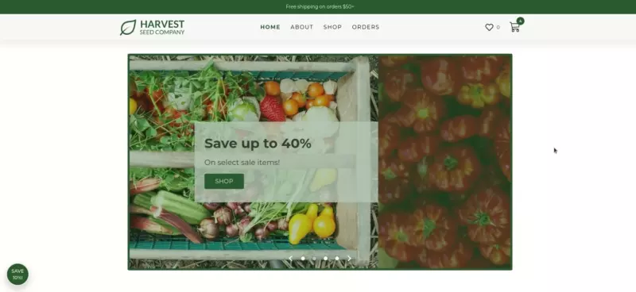
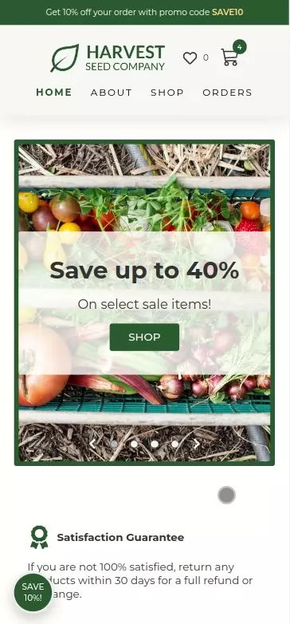
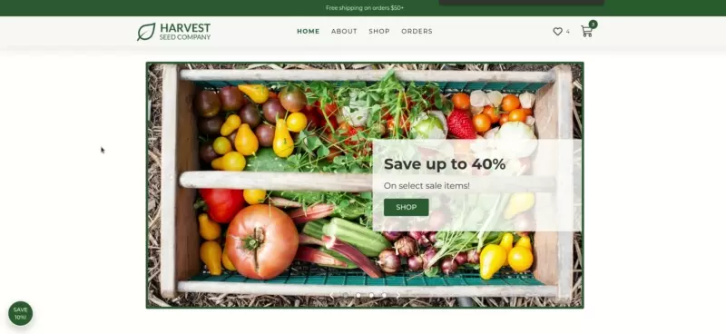
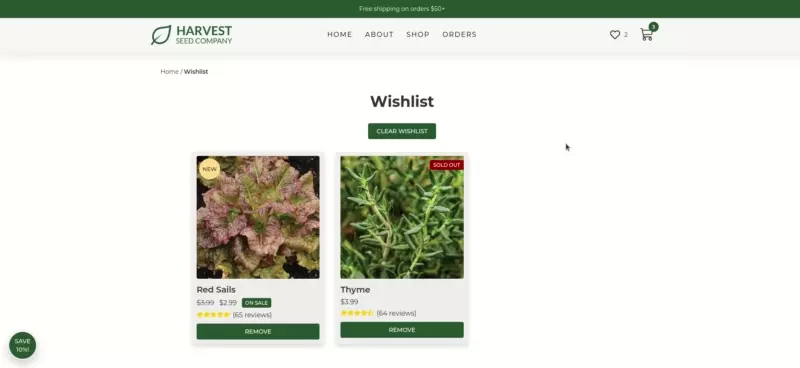
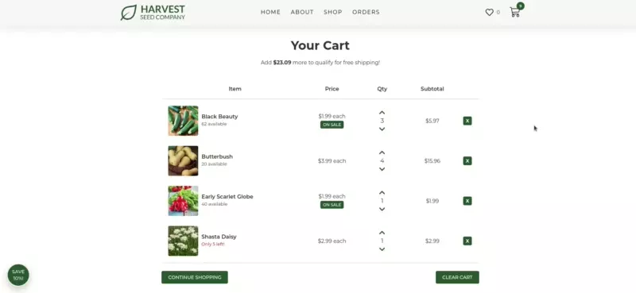
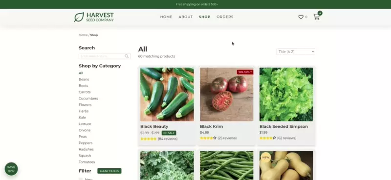

<p align="center">
  
</p>

**Harvest Seed Company is an e-commerce website built with React and Redux Toolkit.**

- The live site is available to view and use at: https://seeds.krisdoyon.com

- You can view my personal website to learn more about me and see my other projects at: https://krisdoyon.com



# Table of Contents

1. [Overview](#overview)
2. [Features](#features)
3. [Technologies used](#technologies-used)
4. [Project architecture](#project-architecture)
5. [Challenges](#challenges)
6. [Data](#data)
7. [Screenshots](#screenshots)

# Overview

I created this site with with the intention of building on my React skills with a project of slightly higher complexity. Specifically my goal was to focus on creating an mantaining a clean file structure organized into page specific and site wide reusable components, and also to practice managing multiple states at once using Redux. Other areas that I focused on and praciced include form validation, sorting and filtering data, and using the local storage API. I chose vegetable seeds as the content for this project as I am an avid gardener.

# Features

Users can:

- Add and remove products from their cart and wishlist.
- Keep track of all previously placed orders.
- Load a set of test orderes and clear all orders to reset app to initial state.
- Search for products by name or category.
- Filter products by category, new, on sale, or in stock.
- Sort products alphabetically or by price.
- Apply a promo code in their cart.

# Technologies used

- React
- React Router
- React Portals
- SCSS Modules
- Redux Toolkit
- Local Storage API

# Project Architecture

#### Component Structure

I created a common layout which is used on all pages and includes the banner, header and footer. Each page has it's own folder with a base component that is rendered when a user navigates to that individual route. Page specific components (such as slider and checkout form) are located in their respective page folders, and shared components (such as breadcrumb and custom checkbox) are located in a separate components folder. Each component has its own folder with a ComponentName.module.scss file for styling, and an index.js file which exports the component for more concise import statements.

#### State Management

I created a five separate slices in the redux store for state management, one for each of the following: cart, checkout form, modal, orders and products. I combined the state for the wishlist and products into one slice as they were closely related and dependent on the same data (more below in the challenges section). I used several useEffect calls with appropriate dependencies in the App.js file to watch for changes in the different state values and then write respective changes to local storage. On the initial app render the initial state attempts to load state values from local storage and falls back to a default value if no data is found.

#### SCSS Modules

This was my first project using SCSS modules. I initially started this project using styled components, but made the decision to switch about half way through as I was finding it difficult to mange styling and functionality all in once place. While I do see the value that styled components bring, I think that the distinct separation of concerns that SCSS modules afford allowed me to better focus my efforts while learning new concepts in this project while still keeping styles locally scoped.

Making this switch also helped me to see the value in making careful selections of project structure and tools from the beginning, as it took me several hours to convert the work that I had completed up to that point from styled components to modules.

# Challenges

One challenge that I faced while working on this project was accurately maintaining the state of wishlist items when product orders were added. Initially I created a separate slice for the wishlist in the store. When an order was added, the in stock quantities would show accurately in the "shop" section, but not in the wishlist. For example, an item in the wishlist would continue to show "low stock" even after an order was placed puchasing all of the remaining quantity of that item, when it should have instead shown "sold out". I initally solved this by getting the new products from local storage, maintaining an array of those products in the wishlist state, and then creating an action to update the wishlist based on those new products. I later realized that I was maintaining the same array of products in two places, and combined the wishlist slice into the products slice as they were closely related and dependent on the same data. This allowed me to reduce the number of actions dispatched when an order was added, and led to a correct output with no bugs.

Another area that proved somewhat challenging was validation of inputs in the checkout form. This was not something that I originally intended to focus heavily on when I set out to create this project but I ended up learning a lot about the advantages and disadvantages of different input types (text vs number for example) and how to use regex for input validation. One problem that I struggled with specifically was correctly rendering the submit order button as disabled/enabled combined with the "shipping address same as billing address" feature while still persisting user input in those optional boxes. I solved the issue that I was having by only incorporating the shipping address inputs into the overall form validity when the box was unchecked, ignoring them otherwise.

In general, creating this app was great practice with slightly more complex state mangement. Some additional situations that I had to come up with solutions for included:

- Preventing the user from adding a higher quantity of an item to the cart than are currently in stock.
- Addressing edge cases of users already having items in their cart when test orders are loaded or all orders are cleared.
- Updating the "in stock" quantities in all appropriate places when orders are placed.

# Data

The images and descriptions for all products were used, with permission, from the MIgardener website. Check out their website at https://migardener.com !

I generated data for this project starting with a spreadsheet. I assigned a unique ID to each product (such as BEAN1, BEET3 etc.) along with all the necessary information with one product per spreadsheet row:


I then downloaded the spreadsheet as a tab separated values file and wrote a NodeJS script to read the .tsv file and write it to JSON with each product as a JSON object literal:

```json
[
  ...
  {
    "id": "FLOW1",
    "title": "Orange Poppy",
    "category": "flowers",
    "price": 399,
    "salePrice": 299,
    "description": "These delicate flowers are a beautiful orange color. They will flower in the cooler temperatures, weeks before other annuals to bring you a spark of joy. Great for attracting beneficial pollinators like bumble bees and honeybees. Poppies will put on a show for around 10 days before they head into dormancy for the next season. Deer and rabbit resistant!",
    "inStock": 25,
    "details": { "isNew": false, "seedCount": 500, "daysToMaturity": 120 },
    "reviews": { "avg": 5, "num": 40 },
    "imgURL": "/img/products/FLOW1.webp",
    "linkURL": "/shop/flowers/FLOW1"
  },
  ...
]
```

The JSON file is then imported into the products slice where it is used as the initial state if there are no previous values in local storage.

# Screenshots

#### Mobile:



#### Home:



#### Shop:


#### Wishlist:



#### Orders:



#### Cart:



#### Checkout:


