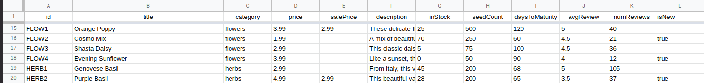

<p align="center">
  
</p>

**Harvest Seed Company is an ecommerce website built with React and Redux Toolkit.**

- The live site is available to view and use at: https://seeds.krisdoyon.com

- You can view my personal website to learn more about me and see my other projects at: https://krisdoyon.com

# Table of Contents

1. [Overview](#overview)
2. [Things Learned](#thingslearned)
3. [Features](#features)
4. [Technologies used](#technologies)
5. [Project architecture](#architecture)
6. [Challenges](#challenges)
7. [Data](#data)
8. [Screenshots](#screenshots)

# Overview

<a href="#overview"></a>

This was my first major personal project using React and Redux.

I designed this app as a personal project to practice and improve my frontend web development skills using HTML, CSS and JavaScript. I did not use any frameworks as my goal was to focus on fundamentals. I practiced many concepts including DOM manipulation, event delegation, state management, and modern ES6 features such as destructuring, array methods and default parameters.

My motivation for this project was my interest as an avid hiker who is working towards completion of several of the peak lists included in the app. The target user would be someone like myself who has particular hiking and peakbagging goals. Instead of keeping track of peak lists progress manually (on paper, in an Excel spreadsheet, etc.) this app would provide the user with graphical representations of their progress and a more streamlined experience.

# Things Learned

<a href="#thingslearned"></a>

- Styling forms (placeholders)
- Form validation
- Redux toolkit for state management

# Features

<a href="#features"></a>

Users can:

- Add and remove products from cart and wishlist.
- Keep track of all orders placed.
- Load a set of test orderes and clear all orders to reset app to initial state.
- Search for products by name.
- Filter products by category, new, on sale, or in stock.
- Sort products alphabetically or by price.
- Apply a promo code

# Technologies Used

<a href="#technologies"></a>

- React

- React Router

- React Portals (for rendering modal)

- SCSS Modules

- Redux Toolkit (for state management)

- Local Storage API (for persisting app state)

# Project Architecture

<a href="#architecture"></a>

#### Component Structure

I created a common layout which is used on all pages, including the banner, header and footer. Each page has it's own folder with a base component that is rendered when a user navigates to that individual route. Page specific components (such as slider and checkout form) are located in their respective page folders, and shared components (such as breadcrumb and custom checkbox) are located in a separate components folder. Each component has its own folder with a ComponentName.module.scss file for styling, and an index.js file which exports the component for more concise import statements.

#### State Management

I created a five separate slices in the redux store for state management, one for each of the following: cart, checkout form, modal, orders and products. I combined the state for the wishlist and products into one slice as they were closely related and dependent on the same data (more below in the challenges section). I used several useEffect calls with appropriate dependencies in the App.js file to watch for changes in the different state values and then write respective changes to local storage. On the initial app render the initial state first tries to load from local storage and falls back to a default value if no data is found.

#### SCSS Modules

This was my first project using SCSS modules. I initially started this project using styled components, but made the decision to switch about half way through as I was finding it difficult to mange styling and functionality all in once place. While I do see the value that styled components bring, I think that the distinct separation of concerns that SCSS modules afford allowed me to better focus my efforts while learning new concepts in this project while still keeping styling scoped to individual components.

Making this switch also helped me to see the value in making careful selections of project structure and tools from the beginning, as it took me several hours to convert the work that I had completed up to that point from styled components to SCSS modules.

#### Form Validation

# Challenges

<a href="#challenges"></a>

One challenge that I faced while working on this project was accurately maintaining the state of wishlist items when product orders were added. Initially I created a separate slice for the wishlist in the store. When an order was added, the in stock quantities would show accurately in the "shop" section, but not in the wishlist. For example, an item in the wishlist would continue to show "low stock" even after an order was placed puchasing all of the remaining quantity of that item, when it should have instead shown "sold out". I initally solved this by getting the new products from local storage, maintaining an array of those products in the wishlist state, and then creating an action to update the wishlist based on those new products. I later realized that I was maintaining the same array of products in two places, and combined the wishlist slice into the products slice as they were closely related and dependent on the same data. This allowed me to reduce the number of actions dispatched when an order was added, and led to a correct output with no bugs.

In general, creating this app was great practice with slightly more complex state mangement. Some situations that I had to come up with solutions for included:

- Preventing the user from adding a higher quantity of an item to the cart than are currently in stock.
- Validating and formatting many different form inputs including zip code, email address, credit card number etc, and only allowing the user to submit the form when all inputs are valid.
- Updating the "in stock" quantities when orders are placed

# Data

<a href="#data"></a>

The images and descriptions for all products were used, with permission, from the MIgardener website. Check out their website at https://migardener.com !

I generated data for this project starting with a spreadsheet. I assigned a unique ID to each product (such as BEAN1, BEET3 etc.) along with all the necessary information with one product per spreadsheet row:



I then downloaded the spreadsheet as a tab separated values file and wrote a NodeJS script to read the .tsv file and write it to JSON with each product as a JSON object literal:

```json
[
  ...
  {
    "id": "FLOW1",
    "title": "Orange Poppy",
    "category": "flowers",
    "price": 399,
    "salePrice": 299,
    "description": "These delicate flowers are a beautiful orange color. They will flower in the cooler temperatures, weeks before other annuals to bring you a spark of joy. Great for attracting beneficial pollinators like bumble bees and honeybees. Poppies will put on a show for around 10 days before they head into dormancy for the next season. Deer and rabbit resistant!",
    "inStock": 25,
    "details": { "isNew": false, "seedCount": 500, "daysToMaturity": 120 },
    "reviews": { "avg": 5, "num": 40 },
    "imgURL": "/img/products/FLOW1.webp",
    "linkURL": "/shop/flowers/FLOW1"
  },
  ...
]
```

The JSON file is then imported into the products slice where it is used as the initial state if there are no previous values in local storage.

# Screenshots

<a href="#screenshots"></a>

#### Mobile:


#### Home:


#### Shop:


#### Wishlist:


#### Orders:


#### Cart:


#### Checkout:

